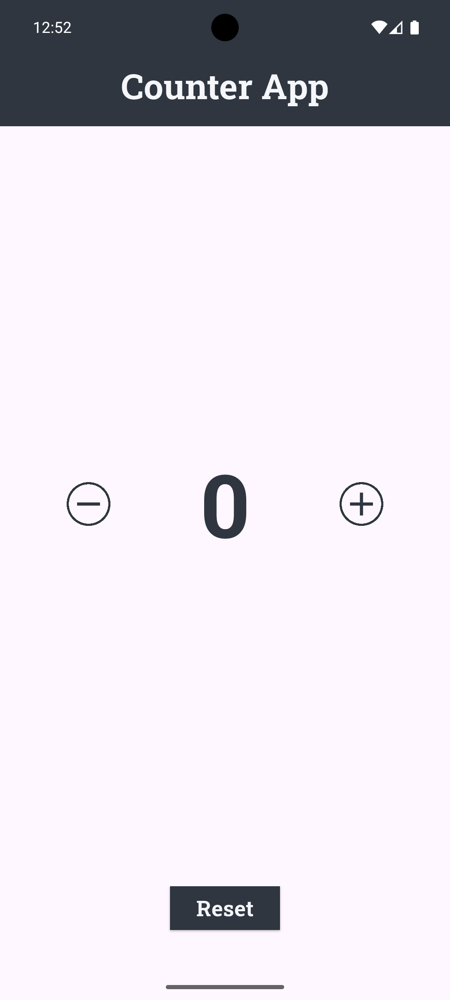
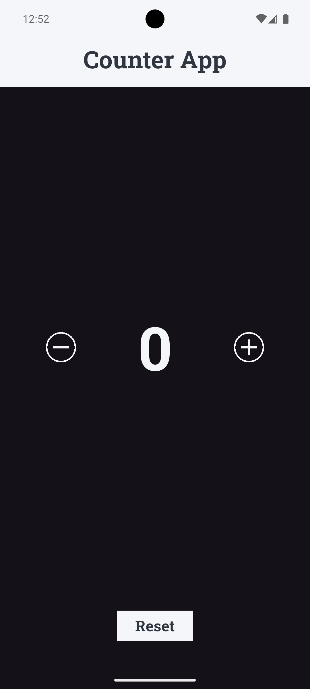

# 🔢 Flutter Counter App (BLoC)

A scalable **Flutter counter application** built using **BLoC state management**. It demonstrates clean architecture, feature-first folder structure, and supports both **light and dark themes**.

---

## 📱 Screenshots


| Light Theme                        | Dark Theme                         |
| --------------------------------- | ---------------------------------- |
|    |      |


---

## 🧱 Folder Structure

```
lib/
├── core/
│   ├── utils/
│   │   ├── app_theme.dart
│   │   ├── app_const.dart
│   │   └── app_color.dart
│   └── widgets/
│       ├── my_app_bar.dart
│       └── app_button.dart
│
├── features/
│   └── counter/              
│          ├── presentation/
|          |     |── widgets/
│          │     |    └── counter_reset_button.dart
│          |     └── screens/
│          |            └── counter_page.dart
│          └── bloc/
│                ├── counter_bloc_bloc.dart
│                └── counter_bloc_event.dart
├── main.dart
└── app.dart
```

---

## 🧠 Features

- ➕ Increment / ➖ Decrement / 🔄 Reset counter
- 🎨 Light & Dark Theme support
- ⚙️ Built using `flutter_bloc`
- 📏 Responsive with `flutter_screenutil`
- 💡 Scalable folder structure for real-world projects

---

## 🧰 Technologies Used

- Flutter
- BLoC (`flutter_bloc`)
- Google Fonts
- ScreenUtil
- Clean Code Practices

---

## 🚀 Getting Started

### 1. Clone the repository

```bash
git clone https://github.com/Error-Imtiaj/Scalable_Counter_App_With_BLOC.git
```

### 2. Install dependencies

```bash
flutter pub get
```

### 3. Run the app

```bash
fvm flutter run
```

Or use VSCode/Android Studio run button.

---

## ⚙️ Build APK (Split-per-ABI)

```bash
fvm flutter build apk --split-per-abi
```

---


## 🧑‍💻 Author

**Mohammad Imtiaj Hossen**\
[GitHub](https://github.com/Error-Imtiaj) | [LinkedIn](https://www.linkedin.com/in/mohammad-imtiaj-hossen-240803286/)

---

## 📄 License

This project is licensed under the MIT License.

